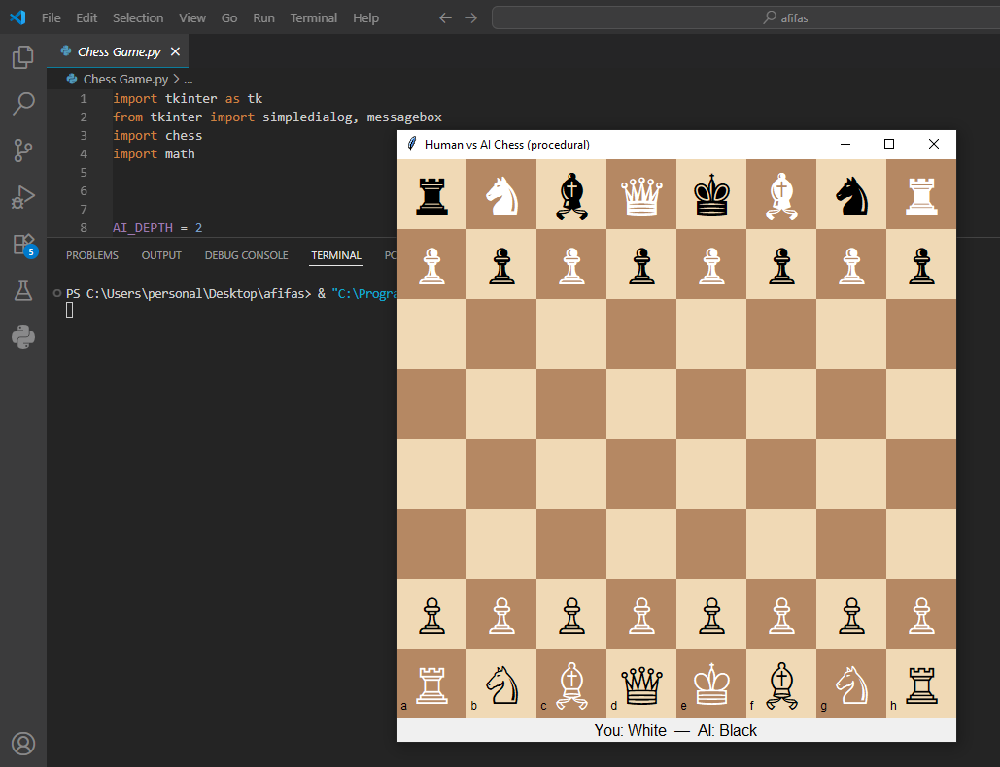

#  Human vs AI Chess (Procedural)  

---

 ##  Description

 1. This is a Chess game developed in Python using **Tkinter** for GUI and **python-chess** library for game logic.  
 2. The game allows a human player to play as **White** against an AI opponent (**Black**) that uses **Minimax algorithm with Alpha-Beta pruning** to make optimal moves.  
 3. The AI evaluates positions and chooses moves to maximize its chance of winning.

---

 ##  How to Run

 1. Make sure Python 3.x is installed on your system.  
 2. Install the required libraries if not already installed:
 ```bash
 pip install python-chess
 ```
 3. Download this repository or clone it using:
 ```bash
 git clone https://github.com/AfifaSabiha50/AI-Course
 ```
 4. Navigate to the project directory and run:
 ```bash
 python chess_procedural.py
 ```
 5. The game window will open and you can start playing.

---

 ##  Requirements / Pre-installed Software

 - **Python 3.x**  
 - **Tkinter** (comes with Python by default)  
 - **python-chess** library (`pip install python-chess`)  
 - **math** module (standard Python library)  

---

 ##  How to Play

 1. You play as **White** and the AI plays as **Black**.  
 2. Click on a White piece to select it; legal moves will be highlighted.  
 3. Click on a highlighted square to move the piece.  
 4. If a pawn reaches the last rank, you can promote it by typing `q/r/b/n` (Queen/Rook/Bishop/Knight).  
 5. The AI will automatically make its move after yours.  
 6. The game ends when:  
    - Checkmate 🎉 (winner displayed)  
    - Stalemate — Draw  
    - Insufficient material — Draw  
    - Other draw conditions  
 7. Close the window or restart to play again.

---

 ##  Algorithm Used

 **Minimax Algorithm with Alpha-Beta Pruning**:
 - AI evaluates all legal moves up to a depth of `AI_DEPTH` (default 2).  
 - Maximizing player: AI (Black), Minimizing player: Human (White).  
 - Uses board evaluation function based on **piece values**.  
 - Alpha-Beta pruning skips unnecessary branches to optimize performance.  
 - Guarantees strong play, especially at shallow depth.

---

 ##  Screenshot

 

---

