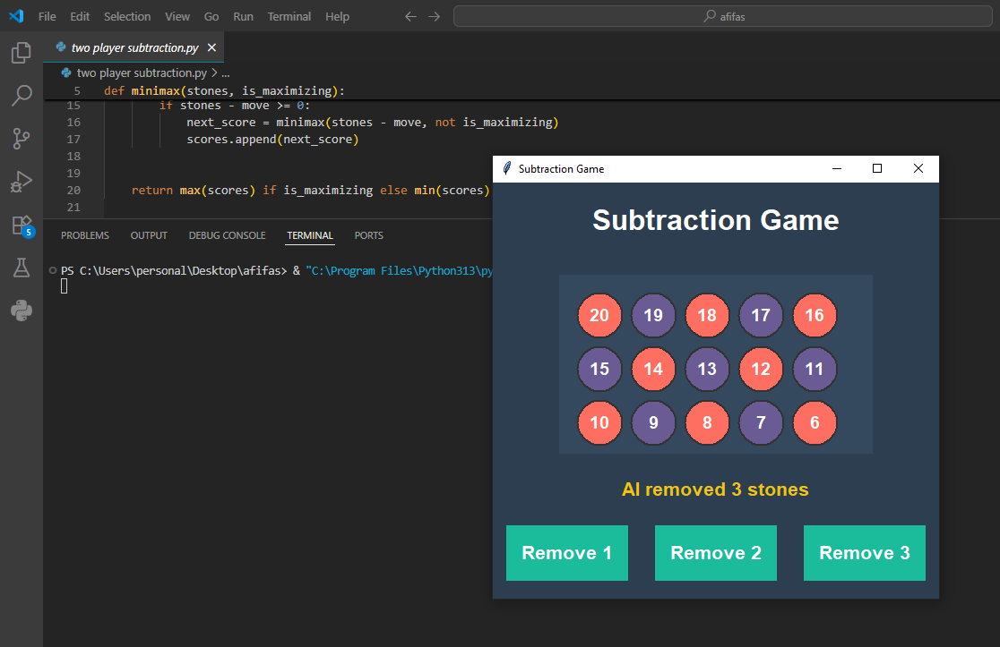

#  Subtraction Game (Player vs AI)

---

 ##  Description

 1. This is a Subtraction Game developed in Python using **Tkinter** for GUI.  
 2. The game starts with a pile of stones (default 25).  
 3. Two players — **Human** and **AI** — take turns removing 1, 2, or 3 stones.  
 4. The player who removes the last stone **loses**.  
 5. The AI uses the **Minimax Algorithm** to always play optimally.

---

 ##  How to Run

 1. Make sure Python 3.x is installed on your system.  
 2. Tkinter should be installed (usually comes pre-installed with Python).  
 3. Download this repository or clone it using:
 ```bash
 git clone https://github.com/AfifaSabiha50/AI-Course
 ```
 4. Navigate to the project directory and run:
 ```bash
 python subtraction_game.py
 ```
 5. The game window will open and you can start playing.

---

 ##  Requirements / Pre-installed Software

 - **Python 3.x**  
 - **Tkinter** (Python GUI library, comes with Python by default)  
 - **math** module (standard Python library, no installation required)  

---

 ##  How to Play

 1. You play first as **Human**.  
 2. Click the button to remove 1, 2, or 3 stones from the pile.  
 3. The AI will automatically remove stones after your move.  
 4. The game ends when all stones are removed:  
    - If you remove the last stone → **You Win! 🎉**  
    - If AI removes the last stone → **AI Wins! 🤖**  
 5. Close the window to restart the game.

---

 ##  Algorithm Used

 The AI uses the **Minimax Algorithm**:  
 - Recursive decision-making algorithm to choose optimal moves.  
 - Considers all possible moves and their outcomes.  
 - Maximizes AI’s chances of winning and minimizes the player’s chances.  
 - Guarantees perfect play, meaning the AI will never lose if it plays optimally.

---

 ##  Screenshot

 

---

