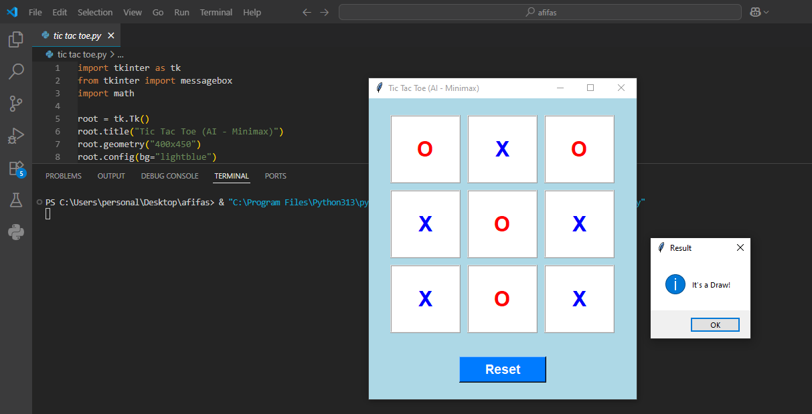

#  Tic Tac Toe Game (AI - Minimax)

---

 ##  Description
 
 1.This is a Tic Tac Toe game developed in Python using **Tkinter** for the GUI.  
 2.The game allows a human player to play against an AI opponent that uses the **Minimax algorithm** for optimal moves.  
 3.The AI always plays with "O" while the human player plays with "X".

---

 ##  How to Run
 
 1. Make sure Python is installed on your system (Python 3.x recommended).  
 2. Install **Tkinter** if not already installed (usually comes pre-installed with Python).  
 3. Download this repository or clone it using:
 ```bash
 git clone https://github.com/AfifaSabiha50/AI-Course
 ```
 4. Navigate to the project directory and run:
 ```bash
 python tic_tac_toe_ai.py
 ```
 5. The game window will open and you can start playing.

---

 ##  Requirements / Prerequisites
 
 - **Python 3.x**  
 - **Tkinter** (Python GUI library, comes with Python by default)  
 - **math** module (standard Python library, no installation required)  

---

 ##  How to Play
 
 1. You play as **X** and the AI plays as **O**.  
 2. Click on any empty cell in the 3x3 grid to make your move.  
 3. The AI will respond automatically with its move.  
 4. The game ends when:  
    - You win 🎉  
    - AI wins 😈  
    - Draw / Tie  
 5. Click the **Reset** button to start a new game.

---

 ##  Algorithm Used
 
 The AI uses the **Minimax Algorithm**:  
 - A recursive algorithm to choose the optimal move.  
 - The AI evaluates all possible moves to maximize its chances of winning and minimize the player's chances.  
 - Guarantees perfect play, meaning it will never lose, it's goal is to either win or at least force a draw!

---

 ##  Screenshot
 
 

---

 
